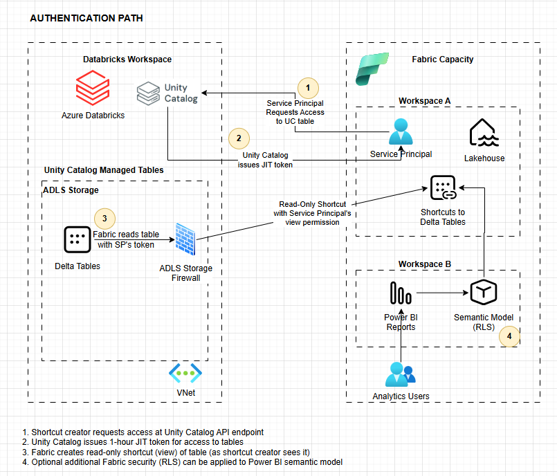
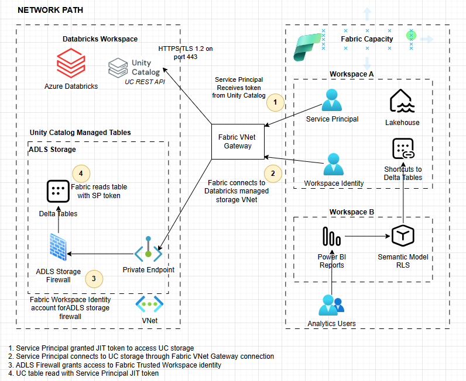

# Databricks Unity Catalog Mirror to Microsoft Fabric
Architectural resources for Databricks Unity Catalog mirror to Fabric.

## Overview
* This repo exists to provide architectural understanding of the Microsoft Fabric Databricks Unity Catalog Mirror, which is hard to intuit from the documentation below. 
* Fabric UC Mirror exists to enable Fabric analytics tools (Power BI, Maps, etc.) to leverage Databricks data with zero data movement and without bypassing Unity Catalog for access or audit.

## Azure Databricks Documentation
* [Publish a Unity Catalog catalog to Microsoft Fabric](https://learn.microsoft.com/en-us/azure/databricks/partners/bi/fabric-publish)
* [Use Microsoft Fabric to read data that is registered in Unity Catalog](https://learn.microsoft.com/en-us/azure/databricks/partners/bi/fabric-mirror)

## Microsoft Fabric Documentation
* [Mirroring Azure Databricks Unity Catalog](https://learn.microsoft.com/en-us/fabric/mirroring/azure-databricks)
* [Tutorial: Configure Microsoft Fabric mirrored databases from Azure Databricks](https://learn.microsoft.com/en-us/fabric/mirroring/azure-databricks-tutorial)
* [Connect to Azure Databricks workspaces behind a private endpoint](https://learn.microsoft.com/en-us/fabric/mirroring/azure-databricks-private-endpoint)
* [Secure Fabric mirrored databases from Azure Databricks](https://learn.microsoft.com/en-us/fabric/mirroring/azure-databricks-security)
* [Limitations in Microsoft Fabric mirrored databases from Azure Databricks
Limitations in Microsoft Fabric mirrored databases from Azure Databricks](https://learn.microsoft.com/en-us/fabric/mirroring/azure-databricks-limitations)

## RLS Support
* UC Mirror does not work with tables that have RLS enabled, as described in the "Limitations" section above. This offers two paths forward:
1. Duplicate RLS permissions in the Fabric environment. Projects like [Microsoft PolicyWeaver](https://github.com/microsoft/Policy-Weaver) seek to automate this and reduce the administrative overhead, however Databricks security and audit is no longer applied in this scenario.
2. Create multiple Databricks Gold-layer schemas that are already security-trimmed per-audience, with no RLS on the table. Leverage Fabric CI/CD capability and GitHub or Azure DevOps integration to connect a security-trimmed Fabric Workspace (containing a Power BI model, report, lakehouse, etc.) to the appropriate Databricks schema. 

# AUTHENTICATION PATH
1. Shortcut creator requests access at Unity Catalog API endpoint
2. Unity Catalog issues 1-hour JIT token for access to tables
3. Fabric creates read-only shortcut (view) of table (as shortcut creator sees it)
4. Optional additional Fabric security (RLS) can be applied to Power BI semantic model

# NETWORK PATH
1. Service Principal granted JIT token to access UC storage
2. Service Principal connects to UC storage through Fabric VNet Gateway connection
3. ADLS Firewall grants access to Fabric Trusted Workspace identity
4. UC table read with Service Principal JIT token

Here is the source Draw.io file: 
[Databricks UC Mirror Fabric.drawio](<Databricks UC Mirror Fabric.drawio>)

